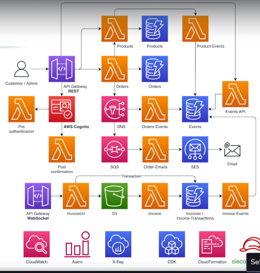

# 🛒 E-commerce API - Serverless (AWS CDK)

  
> *Replace `SEU_USUARIO` and `NOME_DO_REPO` with your actual GitHub username and repo.*

This is a **serverless API project** for an e-commerce platform, built using **Amazon Web Services (AWS)** technologies. The entire infrastructure is provisioned using the **AWS Cloud Development Kit (CDK)** with a focus on scalability, security, performance, and best practices based on **Event-Driven Architecture (EDA)**.

## 🚀 Technologies Used

- **AWS Lambda** – Business logic implemented in serverless functions  
- **Amazon API Gateway** (REST and WebSocket) – Public API exposure  
- **Amazon Cognito** – User authentication and authorization  
- **Amazon SNS & SQS** – Asynchronous communication via events  
- **Amazon SES** – Automatic email notifications  
- **Amazon S3** – Invoice file storage (PDFs)  
- **Amazon CloudWatch, X-Ray, Alarms** – Monitoring and observability  
- **AWS CDK (TypeScript)** – Infrastructure as Code (IaC)  
- **AWS CloudFormation** – Deployment and infrastructure provisioning  

---

## 🧩 Architecture Overview

 <!-- Update path as needed -->

This system follows an **event-driven architecture**, ensuring loosely-coupled services, horizontal scalability, and async workflows.

---

## 📦 Key Features

- User authentication and authorization via AWS Cognito  
- Product catalog management (CRUD)  
- Order placement and tracking  
- Email notifications triggered by events  
- Invoice generation and storage (PDF in S3)  
- WebSocket support for real-time updates  
- Asynchronous pipelines via SNS and SQS  

---

## 📌 API Endpoints (REST)

### Authentication
- `POST /pre-authentication` — Pre-authentication Lambda trigger  
- `POST /confirmation` — Post-signup confirmation (Cognito triggers)

### Products
- `GET /products` — List all products  
- `POST /products` — Create a new product  

### Orders
- `POST /orders` — Create a new order  
- `GET /orders/{id}` — Get order by ID  

### Invoices
- `GET /invoices/{id}` — Retrieve invoice details  
- `GET /invoice-url` — Get pre-signed S3 invoice URL  

---

## 🔄 Event-Driven Workflow Examples

- `ProductCreated` → Event published to EventBridge  
- `OrderCreated` → Notified via SNS, handled asynchronously  
- `OrderConfirmed` → Enqueued in SQS → triggers SES email  
- `InvoiceGenerated` → Saved in S3 + emits `InvoiceEvent`  

---

## 🛠️ How to Run the Project
## Useful commands

* `npm run build`   compile typescript to js
* `npm run watch`   watch for changes and compile
* `npm run test`    perform the jest unit tests
* `npx cdk deploy`  deploy this stack to your default AWS account/region
* `npx cdk diff`    compare deployed stack with current state
* `npx cdk synth`   emits the synthesized CloudFormation template
# api_serverless_ecommerce
